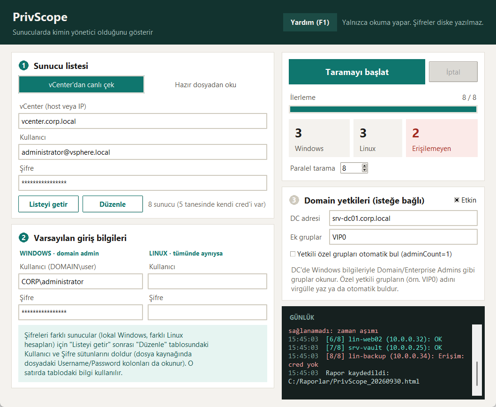
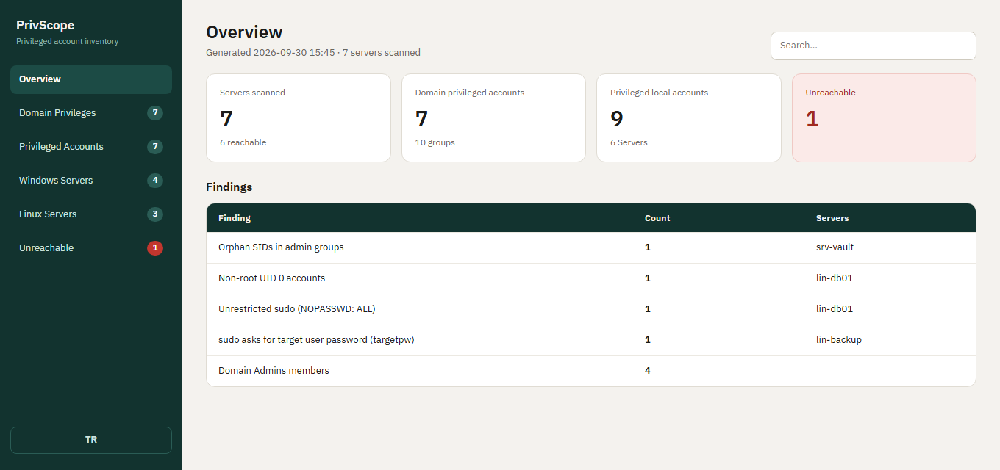
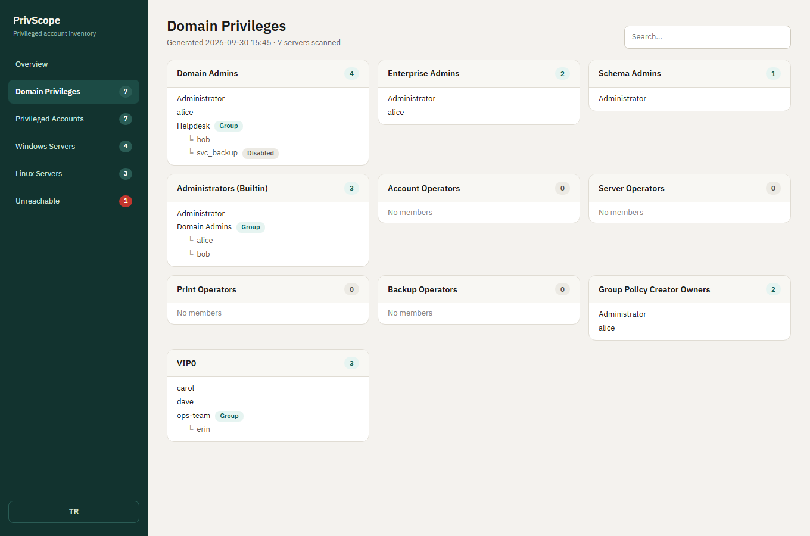
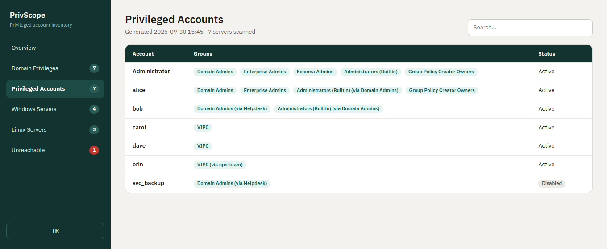
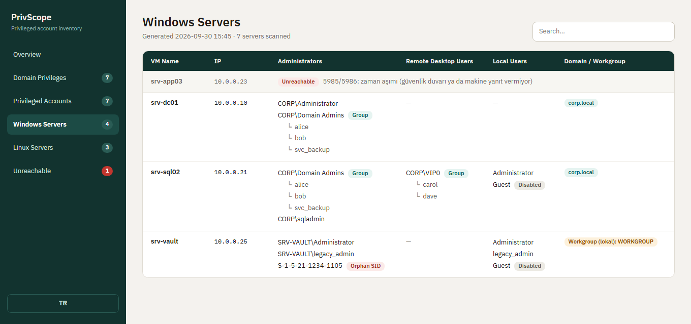

  
⬇

  

    
PrivScope — Windows uygulaması

    
Kurulum gerektirmez. Kaynak kodu GitHub'da, MIT lisanslı.

  

  <a class="download-box-btn" href="https://github.com/kursatbal/privscope/releases/latest" target="_blank" rel="noopener">GitHub'dan indir (.exe · 29 MB)</a>

Bir sunucuda kimin yönetici olduğunu gerçekten biliyor musunuz? Domain Admins üyeleri, her Windows sunucunun yerel Administrators grubu, Linux'ta root ve sudo yetkisi olanlar, iç içe gruplar, silinmiş ama listede kalan hesaplar, kimsenin hatırlamadığı özel yetkili gruplar... Bunları makine makine gezip toplamak saatler, büyük ortamlarda günler alıyor.

**PrivScope** bu işi tek yerden yapar: sunucu listesini vCenter'dan ya da RVTools/Excel/CSV dosyasından alır, Windows ve Linux sunucuları tarar, Active Directory'deki yetkili grupları okur ve sonucu tek dosyalık, aranabilir bir HTML rapora döker.

## Ne yapar?

- **Domain yetkileri:** Domain Admins, Enterprise Admins, Schema Admins, Administrators, operatör grupları ve Group Policy Creator Owners. `VIP0` gibi kendi özel yetkili gruplarınızı adıyla ekleyebilir ya da AD'nin `adminCount=1` işaretinden otomatik buldurabilirsiniz.
- **İç içe gruplar açılır:** Bir grubun üyesi başka bir grupsa, altındaki kullanıcılar da listelenir.
- **Windows sunucular:** Yerel Administrators, Remote Desktop Users, yerel kullanıcılar (devre dışı olanlar işaretli), silinmiş hesaplar (orphan SID) ve makinenin domain'de mi workgroup'ta mı olduğu.
- **Linux sunucular:** UID 0 hesapları, `sudo` / `wheel` / `admin` grup üyeleri, sudoers kuralları ve login shell'i olan kullanıcılar.
- **Bulgular:** Riskli durumlar otomatik listelenir: silinmiş hesap, root dışı UID 0, `NOPASSWD: ALL`, `targetpw`.

## Hedeflere nasıl bağlanır?

| Hedef | Bağlantı | Kullanılan hesap |
|---|---|---|
| Domain'e bağlı Windows | WinRM, olmazsa WMI/DCOM, o da olmazsa ADSI | Domain admin |
| Domain dışı (lokal) Windows | Aynı yöntemler | Makinenin kendi yerel yöneticisi |
| Linux | SSH | root ya da sudo yetkili kullanıcı |
| Domain grupları | Domain controller'a WinRM | Domain admin |

Araç önce hangi portların açık olduğuna bakar (5985/5986, 135, 445) ve yalnızca işe yarayacak yöntemleri dener. Böylece kapalı bir makine taramayı dakikalarca bekletmez. Kimlik bilgisi reddedilirse aynı yanlış şifreyle başka yöntem denenmez, çünkü bu hesabı kilitleyebilir.

## Farklı şifreli onlarca sunucu

Gerçek ortamlarda her sunucunun şifresi aynı olmaz. PrivScope'ta listeyi uygulamanın içinde düzenlersiniz, Excel açmanıza gerek yoktur:

- Satıra çift tıklayıp kullanıcı, şifre ve erişim türünü (`Windows · Domain`, `Windows · Lokal`, `Linux`) girersiniz.
- 30 sunucudan 15'i aynı şifreliyse bunları seçip **tek seferde** atarsınız.
- Domain'e bağlı mı lokal mı olduğunu tahmin etmek için sunucunun DNS adından öneri alırsınız.

## Rapor

Rapor tek bir HTML dosyasıdır; sunucuya gerek yoktur, tarayıcıda açılır. Solda sayfalar, üstte arama, altta Türkçe/İngilizce düğmesi bulunur.

Domain yetkili gruplar kart olarak gösterilir. Gruptan çıkan gruplar açılır, devre dışı hesaplar işaretlenir:

**Hesap bazlı görünüm** en çok işe yarayan sayfadır: bir kişinin hangi yetkili gruplarda olduğu tek satırda görünür. İç içe üyelik `via` ile belirtilir.

Windows sunucu sayfasında her makinenin yerel yöneticileri, RDP kullanıcıları, yerel hesapları ve domain/workgroup durumu bulunur:

## Güvenlik ve dikkat edilmesi gerekenler

- **Yalnızca okur.** Hiçbir hesabı, grubu ya da ayarı değiştirmez.
- **Şifreler diske yazılmaz.** Yalnızca bellekte tutulur, günlükte maskelenir.
- **Yalnızca yetkili olduğunuz sistemlerde kullanın.** Yanlış şifreyle çok sayıda makineye bağlanmak hesap kilitlenmesine yol açabilir, ilk taramayı küçük bir listeyle deneyin.
- **Rapor gerçek hesap bilgisi içerir.** Ekip dışına çıkarmadan önce kontrol edin.
- Exe imzasızdır. Windows SmartScreen uyarı verebilir (**Daha fazla bilgi → Yine de çalıştır**). Güvenmek istemezseniz kaynak kodu okuyup kendiniz derleyebilirsiniz.

Bu yazıdaki görüntüler örnek verilerle hazırlanmıştır, gerçek bir ortamı göstermez.

## İndir ve kaynak

- Uygulama: [GitHub Releases](https://github.com/kursatbal/privscope/releases/latest)
- Kaynak kodu, kullanım kılavuzu ve erişim gereksinimleri (WinRM'i açma, portlar, Linux sudo ayarları): [github.com/kursatbal/privscope](https://github.com/kursatbal/privscope)

İlk sürümdür. Geri bildirim ve düzeltme önerileriniz için GitHub'da issue açabilirsiniz.
