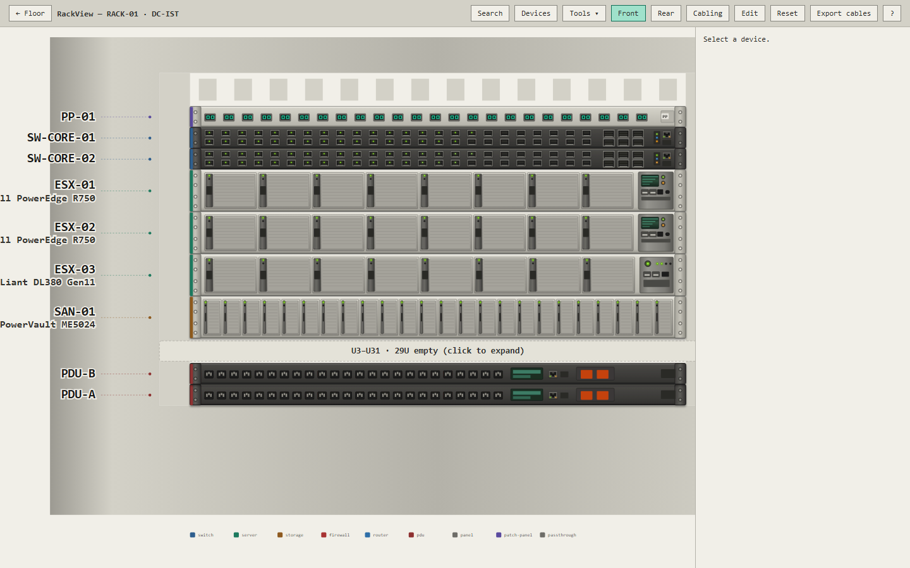
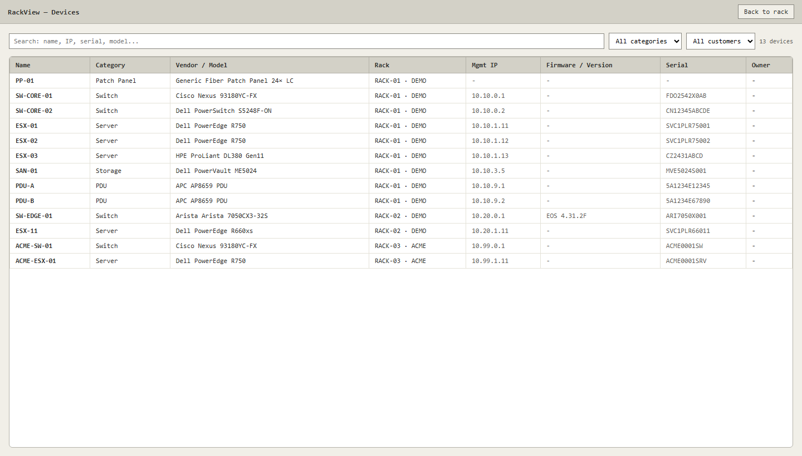
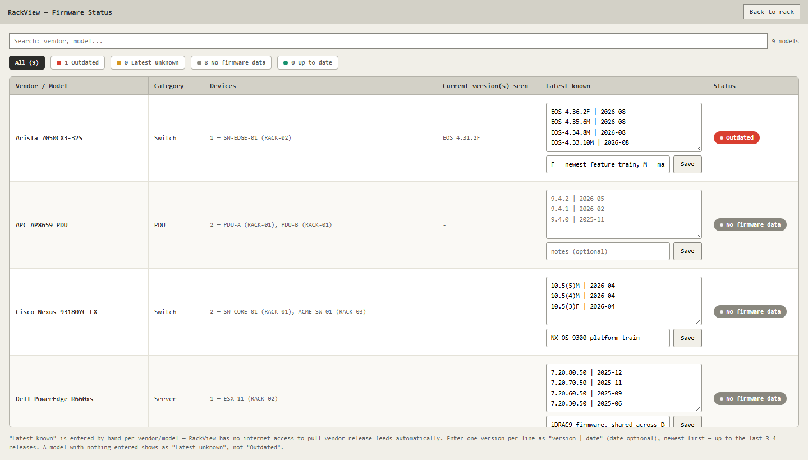

  
⬇

  

    
RackView — Windows uygulaması

    
Kurulum gerektirmez, demo verisiyle açılır. Kaynak kodu GitHub'da, MIT lisanslı.

  

  <a class="download-box-btn" href="https://github.com/kursatbal/rackview/releases/latest" target="_blank" rel="noopener">GitHub'dan indir</a>

Veri merkezinde neyin nereye bağlı olduğunu takip etmek çoğu zaman bir Excel dosyasına, kimsenin güncellemediği bir Visio çizimine ya da ücretli bir uygulamaya bağlı kalıyor. Bir switch'i kapatmanız gerektiğinde "bunun arkasında ne var?" sorusunun cevabı genellikle birinin hafızasında ya da kabinin önünde.

**RackView** bu envanteri görsel hâle getirir: kabinleri, cihazları ve kabloları gerçekçi rack şemaları olarak çizer; aranabilir, sürükle-bırak düzenlenebilir ve canlı cihazlardan doğrulanabilir bir yapıda tutar.

## Ne yapar?

- **220'den fazla cihaz modeli:** Sunucu, switch, firewall, router, storage, SAN switch, patch panel ve PDU. Dell, HPE, Cisco, Arista, Juniper, Fortinet, Palo Alto, Brocade ve diğerleri. Ortak şablonlar sayesinde yeni model eklemek kolaydır.
- **Ön ve arka panel:** Cihazların ön ve arka yüzü arasında geçiş yapılır, cihazlar sürükle-bırak yerleştirilir. Boş U'lar otomatik daraltılır.
- **Akıllı kablolama:** Ön/arka port eşleşmesi otomatik yapılır. Kablo türü renk ve çizgi biçimiyle ayrılır: fiber, DAC, Cat6a, güç ve SAS. Rotalar başka portların üzerinden geçmez.
- **Etki analizi:** "Bu cihaz kapanırsa ne olur?" sorusunun cevabı: hangi servis kesilir, hangi yedeklilik kaybolur, hangi sistemler etkilenmez.
- **Arama:** IP, MAC, seri numarası, port ya da VLAN ile tüm kabinlerde cihaz bulunur (Ctrl+K).
- **Çok kabinli yapı:** Müşteri bazında ayrılmış kabinler, salon görünümü ve kabinler arası kablolama.
- **Excel dışa aktarım:** Bir kabinin ya da cihazın kablolaması `.xlsx` olarak indirilir.

Şemalar üreticilerin ürün fotoğraflarından değil, teknik dokümanlardan çizilmiştir. Amaç birebir kopya değil, tanınabilir ve okunaklı bir şema vermektir.

## LLDP ile kablolama doğrulama

İki ayrı araç var:

- **LLDP Discovery:** Switch'in LLDP çıktısını yapıştırırsınız, her portun bilgi notu olarak kaydedilir. Kablolamaya hiç dokunmaz.
- **LLDP Auto-Cabling:** LLDP komşularını mevcut kablolamayla karşılaştırır, her bağlantı için sizden onay isteyerek eksik kabloları toplu oluşturur, günceller ya da kaldırır. Henüz kabinde olmayan komşular için seçici sunar.

## Canlı doğrulama araçları

Üst çubuktaki **Tools** menüsü dokuz aracı tek yerde toplar. Bazıları gerçek cihazlardan bilgi çeker:

- **SAN Switch Mapping:** Brocade FOS ya da Cisco MDS'ten SSH ile port ve zoning bilgisi.
- **Storage Mapping:** Dell PowerVault/ME ve HPE MSA için FC port durumu ve WWN bilgisi, her port RackView'daki kablolamayla karşılaştırılır.
- **ESXi NIC Verification:** vSphere API üzerinden fiziksel NIC durumu ve vSwitch eşleşmesi. Tek bir vCenter girişiyle altındaki tüm host'lar keşfedilir ve IP'ye göre kabindeki cihazlarla otomatik eşleştirilir.
- **iDRAC / iLO:** Redfish üzerinden BIOS ve BMC sürümü, sağlık durumu ve NIC, RAID kartı, PSU, CPLD dahil tam bileşen firmware envanteri.
- **Activity Log:** Her cihaz ve kablo değişikliği, öncesi ve sonrası farkıyla zaman damgalı kaydedilir.

## Cihazlar ve firmware durumu

**Devices** ekranı tüm kabinlerdeki cihazları tek tabloda toplar. Sıralama, filtreleme ve arama yapılır; bir satıra tıklayınca cihaz kendi kabininde açılır.

**Firmware Status** ekranı cihazları üretici ve modele göre gruplar, üzerinde çalışan sürümü elle girilmiş "bilinen son sürüm"le karşılaştırır ve eski olanları işaretler. Yaklaşık 210 katalog modeli için son 3-4 sürümün geçmişi hazır gelir. RackView internete çıkmaz, bu yüzden "son sürüm" listesi otomatik değil elle güncellenir. Verisi girilmemiş bir model "Outdated" değil "Latest unknown" olarak görünür.

## Nasıl çalışır?

- **Arka uç:** Python, Flask ve SQLite.
- **Ön yüz:** Saf JavaScript ve satır içi SVG. React, Vue ya da derleme adımı yok.
- **Dağıtım:** Windows için tek exe ya da Python ile yerel sunucu (`python seed.py`, sonra `python app.py`, tarayıcıda `127.0.0.1:5000`).
- **Sunucu:** Araçlar arası gezinirken yaşanan ara sıra takılmaları gidermek için üretim sınıfı bir WSGI sunucusu (waitress) kullanılır.

Canlı çekim araçları gerçek donanımda denendi: Brocade SAN switch, Dell ME4024 storage, ESXi host ve vCenter. Bu testlerde iki hata bulunup düzeltildi: Storage Mapping firmware bilgisini hiç çekmiyordu, vCenter üzerinden çekilen ESXi sürümü host'unkini değil vCenter'ınkini gösteriyordu. HPE MSA desteği henüz gerçek donanımda doğrulanmadı, yalnızca Dell ME4024 uçtan uca denendi.

## Güvenlik ve dikkat edilmesi gerekenler

- **Kimlik bilgileri kaydedilmez.** SAN, storage, ESXi ve iDRAC/iLO araçlarında kullanıcı adı ve şifre yalnızca o çekim için kullanılır, diske yazılmaz. Sadece IP ve cihazın bildirdiği durum saklanır.
- **Veri yerelde kalır.** Uygulama internete çıkmaz, veritabanı kendi bilgisayarınızdadır.
- Exe imzasızdır. Windows SmartScreen uyarı verebilir (**Daha fazla bilgi → Yine de çalıştır**).
- Bu yazıdaki görüntüler uygulamanın demo verisiyle hazırlanmıştır, gerçek bir müşteri ortamını göstermez.

## İndir ve kaynak

- Uygulama: [GitHub Releases](https://github.com/kursatbal/rackview/releases/latest)
- Kaynak kodu ve kullanım: [github.com/kursatbal/rackview](https://github.com/kursatbal/rackview)

Eksik bir cihaz modeli ya da isteğiniz varsa GitHub'da issue açabilirsiniz.
